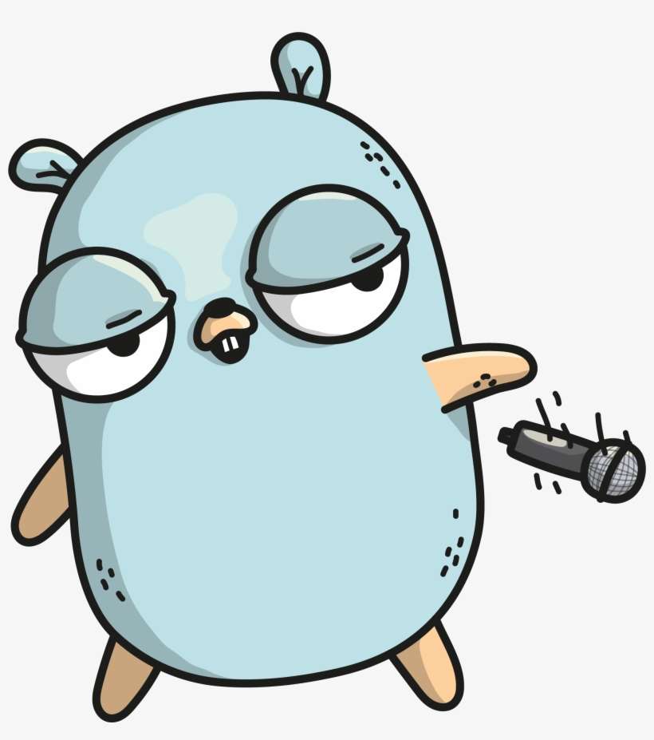

# HayMaker

  

# Description
HayMaker is a tool that to create Kubenetes cluster on AWS as well as ECR repository if you need private images. You can then build the images and push them to the ECR repo and deploy them through Kubernetes. 

# Dependencies
- Docker SDK (https://docs.docker.com/develop/sdk/)
- Kubernetes SDK (https://github.com/kubernetes/client-go)
- AWS SDK (https://github.com/aws/aws-sdk-go)

## The Current Features
- Create ECR repository
- Spinup EKS cluster on AWS (network is included)
- Generate Kubeconfig
- Build Docker image and push it to ECR
- Create Docker containers on AWS EKS based on any image (e.g. either local and pused to ECR as well as any image from docker repo). Tune the haymaker_config.json as needed. 

## The Project Structure
My programming projects tend to follow the same structure: 
- Engines are the files where you find the low-level interction with the necessary SDKs. Some of the SDK functions are called through stubs on some files for modularity and because it makes the code cleaner. 
- The util folder contains JSON processors, configuration parsers and updaters as well as kubeconfig template and filler. 
- Policies and Permissions folder contains notes on the priviliges, roles and policies you must enable on your AWS to run the tool. I chose not to automate this part because it is a one time process and would clutter the code. 
- Docker: contains a simple Dockerfile and some resources to create a test container if you feel to lazy to prepare it. 
- Commandline parsers and processors: classes that generate command line processors (out-of-the-box Go flags), process them and call the appropriate engines. 

## Potential Bugs
1. The configuration file is complex and i have some functionality to update it to avoid the user wasting time touching it. A full deployment works fine but you may run into problems if you start picking specific isolated features (e.g. you try to create a service but forgot to update the container path and name on config file, i.e. kubernetes->image_name)
2. Cleaning Network resources on AWS is complex and prone to failure (e.g. deleting Network interfaces right after deleting loadbalancers may fail). While i have tested it multiple times and left the necessar checks, you may run into problems. Let me know or just remove manually :( 

## Found this useful? Help me buy a new mic for the Gopher that just dropped it:
https://www.paypal.com/donate/?hosted_button_id=UDFXULV3WV5GL

